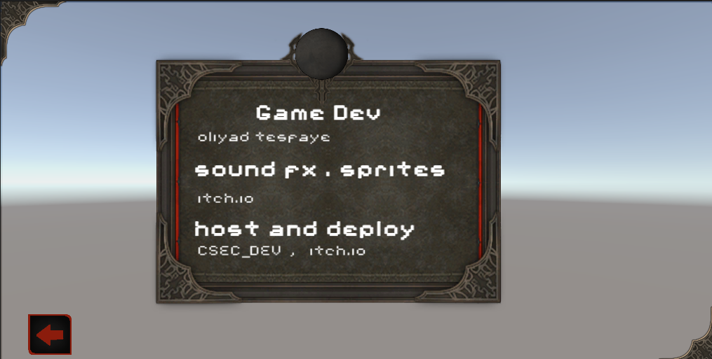
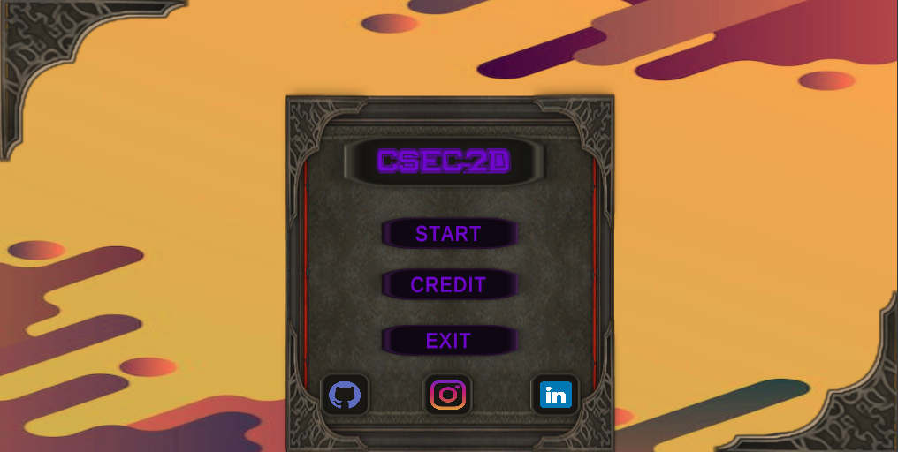

# CSEC_DEV GAME:


-2D platform simple game made with unity the player must reach the goal to win this game.

## Installing:

1.install the latest verion of unity or 2021-2023 version is enough
2.clone project
 ``` bash
    git clone https://github.com/olitillinfintye/CSEC-DEV-GAME.git
```
## Project Path

[project](Assets/@project/Scene)
=======

-2D platform simple game made with unity the player must reach the goal to win this game.

## Installing:

1.install the latest verion of unity or 2021-2023 version is enough

2.clone project
 ``` bash
    git clone https://github.com/olitillinfintye/CSEC-DEV-GAME.git
```
## Play on browser or pc

[play](https://olitillinfintye.itch.io/csec-dev-game) on brower

[Download](CSEC_DEV-PC.zip) for pc build
## Project Path

[project](Assets/@project/Scenes)
## images



>>>>>>> 2e367e5168a1a1f2267c08b49ffb69187db0d424
